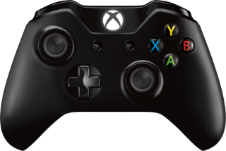

# BLE-Gamepad-Client

[](https://www.ardu-badge.com/BLE-Gamepad-Client)
[](https://registry.platformio.org/libraries/tbekas/BLE-Gamepad-Client)

This library enables connecting BLE (Bluetooth Low Energy) gamepads to ESP32 boards. Supported gamepads include the Xbox
Wireless Controller and the Steam Controller.

# Arduino Library

* Open Arduino Library Manager: Tools -> Manage Libraries.
* Search for `BLE-Gamepad-Client` and install it.

# PlatformIO dependency

Add the following line to
the [lib_deps](https://docs.platformio.org/en/latest/projectconf/sections/env/options/library/lib_deps.html) option
of [platformio.ini](https://docs.platformio.org/en/latest/projectconf/index.html) file.

```yaml
tbekas/BLE-Gamepad-Client@^0.5.0
```

# Example usage

```cpp
#include <Arduino.h>
#include <BLEGamepadClient.h>

XboxController controller;

void setup(void) {
  Serial.begin(115200);
  controller.begin();
}

void loop() {
  if (controller.isConnected()) {
    XboxControlsEvent e;
    controller.readControls(e);

    Serial.printf("lx: %.2f, ly: %.2f, rx: %.2f, ry: %.2f\n",
      e.leftStickX, e.leftStickY, e.rightStickX, e.rightStickY);
  } else {
    Serial.println("controller not connected");
  }
  delay(100);
}
```

# More examples

Checkout the code examples in
the [examples directory](https://github.com/tbekas/BLE-Gamepad-Client/tree/0.5.0/examples).

# Supported gamepads

### Steam Controller


#### Firmware:

Install BLE firmware using these instructions: [Steam Controller BLE](https://help.steampowered.com/en/faqs/view/1796-5FC3-88B3-C85F).

#### Pairing instructions:

* Turn on your controller by pressing the Steam button while holding the Y button.

#### Classes:

* `SteamController`
* `SteamControlsEvent`

### Xbox One Wireless Controller (models 1697 and 1708 - 2 buttons)



#### Firmware:

Update controller's firmware to version 5.x using these
instructions: [Update your Xbox Wireless Controller](https://support.xbox.com/en-US/help/hardware-network/controller/update-xbox-wireless-controller).

#### Pairing instructions:

* Turn on your controller by pressing the Xbox button.
* Press and hold the controller’s pair button for 3 seconds, then release.

#### Classes:

* `XboxController`
* `XboxControlsEvent`
* `XboxBatteryEvent`
* `XboxVibrationsCommand`

### Xbox Series S/X Wireless Controller (model 1914 - 3 buttons)


#### Firmware:

Your controller most likely already runs firmware version 5.x. If not, follow these instructions to update
it: [Update your Xbox Wireless Controller](https://support.xbox.com/en-US/help/hardware-network/controller/update-xbox-wireless-controller).

#### Pairing instructions:

* Turn on your controller by pressing the Xbox button.
* Press and hold the controller’s pair button for 3 seconds, then release.

#### Classes:

* `XboxController`
* `XboxControlsEvent`
* `XboxBatteryEvent`
* `XboxVibrationsCommand`

# Acknowledgments

* [h2zero](https://github.com/h2zero) for the excellent [NimBLE-Arduino](https://github.com/h2zero/NimBLE-Arduino)
  library, which this library is built upon.
