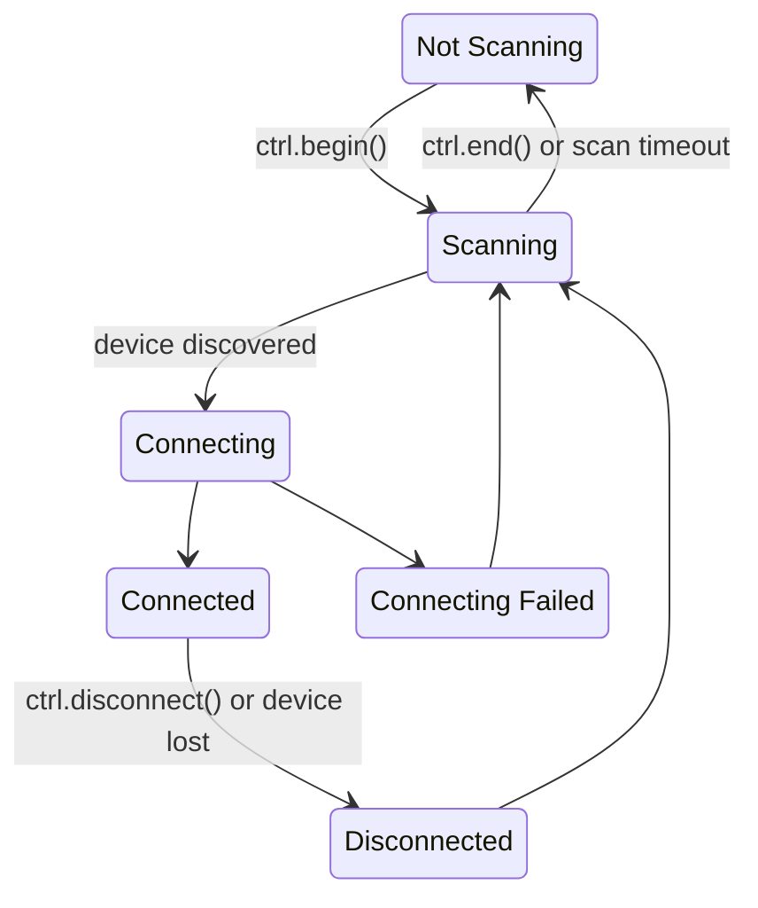

# Auto-scan feature

The auto-scan feature (enabled by default) simplifies connecting BLE controllers by automatically managing the scanning
process in the background. It starts scanning whenever there are any initialized controller instances that are not
yet connected, and stops scanning once all instances are connected. Whenever a controller disconnects scanning is
started again.

# State diagram

Below is the visual representation of state transitions (assuming you are connecting to a single controller).

# How it works

* When you call `begin()` on a controller instance, the library increments the number of connection slots.
* Each time a controller connects to the board, it occupies one of those slots.
* Each time a controller disconnects, it releases its occupied slot.
* Scanning automatically starts when there are unoccupied connection slots (at least one controller is not
  connected). Scanning stops when all slots are occupied.

# Changing the default behavior

You can disable auto-scan by calling the static method `BLEGamepadClient::getAutoScan()->disable()` before initializing
any controller instance with `begin()`. If you do so, you will need to manually manage scanning—i.e., starting and
stopping it as needed.
