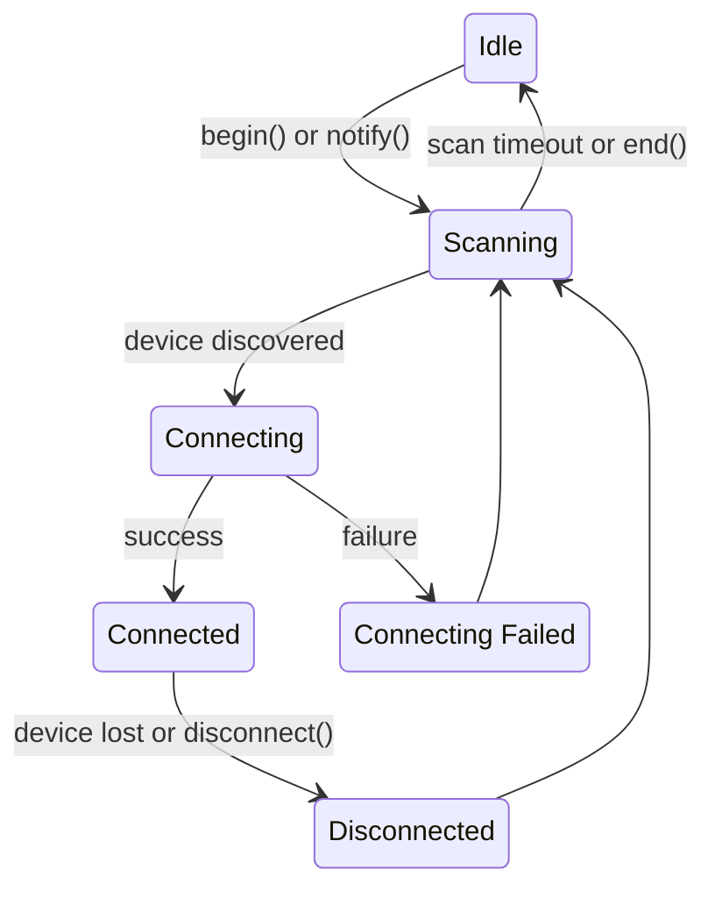

# Auto Scan

## How it works

The auto-scan feature (enabled by default) simplifies connecting BLE controllers by automatically managing the scanning
process in the background. It **starts scanning whenever there are any controller instances that are not
yet connected**, and stops scanning once all instances are connected. Whenever a controller disconnects scanning is
started again.

## State diagram

Below is the visual representation of state transitions.

