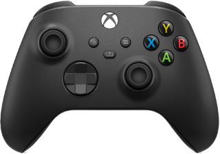

# Controllers

## Supported gamepads

### Steam Controller

#### Firmware

Install BLE firmware using these instructions: [Steam Controller BLE](https://help.steampowered.com/en/faqs/view/1796-5FC3-88B3-C85F).

#### Pairing instructions

* Turn on your controller by pressing the Steam button while holding the Y button.

#### Classes

* `SteamController`
* `SteamControlsState`

### Xbox One Wireless Controller (models 1697 and 1708 - 2 buttons)

#### Firmware

Update controller's firmware to version 5.x using these
instructions: [Update your Xbox Wireless Controller](https://support.xbox.com/en-US/help/hardware-network/controller/update-xbox-wireless-controller).

#### Pairing instructions

* Turn on your controller by pressing the Xbox button.
* Press and hold the controller’s pair button for 3 seconds, then release.

#### Classes

* `XboxController`
* `XboxControlsState`
* `XboxBatteryState`
* `XboxVibrationsCommand`

### Xbox Series S/X Wireless Controller (model 1914 - 3 buttons)

#### Firmware

Your controller most likely already runs firmware version 5.x. If not, follow these instructions to update
it: [Update your Xbox Wireless Controller](https://support.xbox.com/en-US/help/hardware-network/controller/update-xbox-wireless-controller).

#### Pairing instructions

* Turn on your controller by pressing the Xbox button.
* Press and hold the controller’s pair button for 3 seconds, then release.

#### Classes

* `XboxController`
* `XboxControlsState`
* `XboxBatteryState`
* `XboxVibrationsCommand`
